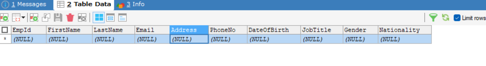
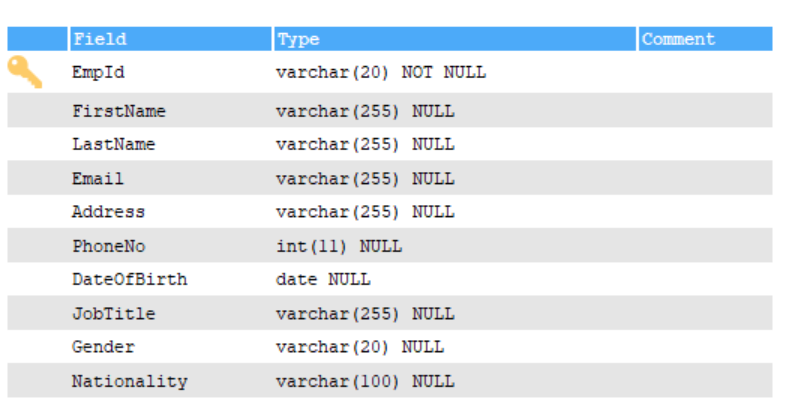
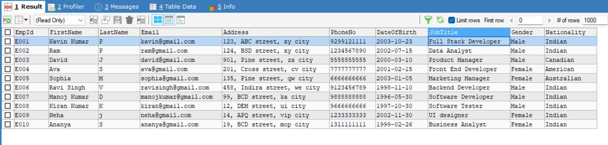
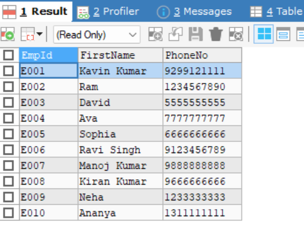

# Creating and Populating Tables

## Steps:

- Create a table using `CREATE TABLE table_name` query with 10 columns to collect the employees data and in that `EmpId` act as a `Primary Key` to keep a unique values for accessibility

```bash
CREATE TABLE Employees(
  EmpId VARCHAR(20) PRIMARY KEY,
  FirstName VARCHAR(255),
  LastName VARCHAR(255),
  Email VARCHAR(255),
  Address VARCHAR(255),
  PhoneNo VARCHAR(15),
  DateOfBirth DATE,
  JobTitle VARCHAR(255),
  Gender VARCHAR(20),
  Nationality VARCHAR(100)
)
```
### Date types uses

| **Data Type** | **Description** | **Usage** | **Example** |
|---------------|-----------------|-----------|-------------|
| **`VARCHAR(n)`** | Variable-length string. Stores alphanumeric text. The `n` represents the maximum number of characters. | Used for storing strings of varying lengths, such as names, emails, or addresses. | `VARCHAR(255)` for storing a person's name or email address. |
| **`DATE`** | Stores date values in `YYYY-MM-DD` format. | Used for storing date-related information, such as birth dates, event dates, or transaction dates. | `DATE` for storing a person's date of birth. |
## Output




- Insert the data into the table using `INSERT INTO table_name` query and added a 10 employee's record

```bash
INSERT INTO Employees (EmpId, FirstName, LastName, Email, Address, PhoneNo, DateOfBirth, JobTitle, Gender, Nationality)
VALUES
('E001', 'Kavin Kumar', 'P', 'kavin@gmail.com', '123, ABC street, xy city', 9299121111, '2003-10-23', 'Full Stack Developer', 'Male', 'Indian'),
('E002', 'Ram', 'P', 'ram@gmail.com', '124, BSD street, xy city', 1234567890, '2002-07-15','Data Analyst', 'Male', 'Indian'),
('E003', 'David', 'J', 'david@gmail.com', '901, Pine street, zx city', 5555555555, '2000-03-10', 'Product Manager', 'Male', 'Canadian'),
('E004', 'Ava', 'S', 'ava@gmail.com', '201, Cross street, cv city', 7777777777, '2001-02-15', 'Front End Developer', 'Female', 'American'),
('E005', 'Sophia', 'M', 'sophia@gmail.com', '135, Pine street, qw city', 6666666666, '2003-1-05', 'Marketing Manager', 'Female', 'Australian'),
('E006', 'Ravi Singh', 'V', 'ravisingh@gmail.com', '458, Indira street, we city', 9123456789, '1998-11-10', 'Backend Developer', 'Male', 'Indian'),
('E007', 'Manoj Kumar', 'D', 'manojkumar@gmail.com', '99, BCD street, ka city', 9888888888, '1996-05-30', 'Software Developer', 'Male', 'Indian'),
('E008', 'Kiran Kumar', 'K', 'kiran@gmail.com', '12, DEM street, ui city', 9666666666, '1997-10-30', 'Software Tester', 'Male', 'Indian'),
('E009', 'Neha', 'j', 'neha@gmail.com', '14, APQ street, vip city', 1233333333, '2002-11-30', 'UI designer', 'Female', 'Indian'),
('E010', 'Ananya', 'S', 'ananya@gmail.com', '19, BCD street, mop city', 1311111111, '1999-02-26', 'Business Analyst', 'Female', 'Indian')
```

- To get the data from table `SELECT` query is used and in that `*` represents the total column present in the table

```bash
SELECT * FROM Employees
```

## Output



- To get a particular column in the table 

``` bash
SELECT EmpId, FirstName, PhoneNo FROM Employees
```

## Output




