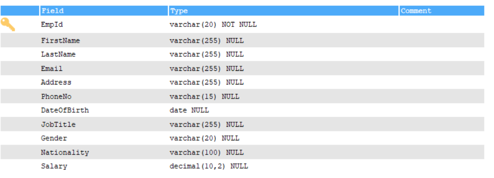

# Basic Filtering and Sorting

## Steps:

- Add additional column called Salary with a data type of `DECIMAL(10,2)`

```bash
ALTER TABLE Employees
ADD Salary DECIMAL(10, 2)
```

## Output



- Add Salary data to old employees by using `UPDATE` and `SET`

```bash
UPDATE Employees
SET Salary = 75000.00
WHERE EmpId IN ('E001', 'E002', 'E003', 'E004');

UPDATE Employees
SET Salary = 85000.00
WHERE EmpId IN ('E005', 'E006', 'E007', 'E008');

UPDATE Employees
SET Salary = 90000.00
WHERE EmpId IN ('E009', 'E010');
```

- Insert some more data who are belongs to `Sales` by `Insert` query

```bash
INSERT INTO Employees (EmpId, FirstName, LastName, Email, Address, PhoneNo, DateOfBirth, JobTitle, Gender, Nationality, Salary)
VALUES
('E011', 'John', 'D', 'john@gmail.com', '123 Elm street, SD city', '5551234567', '1990-05-15', 'Sales', 'Male', 'Indian', 40000.00),
('E012', 'Smith', 'F', 'smith@gmail.com', '456 Oak street, Ml city', '5552345678', '1995-03-22', 'Sales', 'Male', 'American', 55000.00),
('E013', 'Karthick', 'M', 'karthick@gmail.com', '789 Pine street, IL city', '5553456789', '1982-07-30', 'Sales', 'Male','Indian', 70000.00)
```

## Output


- Filter the Data based on `Sales` Department using `WHERE` clause and also Used `LOWER` function to check regardless of the case sensitive

```bash
SELECT EmpId, FirstName, LastName, Email, PhoneNo, JobTitle AS Department FROM Employees
WHERE LOWER(JobTitle) = LOWER('Sales');
```

## Output


- Sort the column in ASCENDING using `ORDER BY` and in this, Sort the `LastName` column in `ASC` order regardless of the case sensitive

```bash
SELECT EmpId, FirstName, LastName, Email, PhoneNo FROM Employees
ORDER BY LOWER(LastName) ASC;
```

## Output


- Sort the Salary Column in DESCENDING using `ORDER BY`

```bash
SELECT EmpId, FirstName, LastName, Email, PhoneNo, Salary FROM Employees
ORDER BY Salary DESC;
```

## Output


- To apply multiple filters, conditional operators like `AND` and `OR` are used. In this case, the data is filtered to show employees who have a salary above 60,000 and whose nationality is Indian

```bash
SELECT EmpId, FirstName, LastName, Email, PhoneNo, Salary, Nationality, Gender FROM Employees
WHERE Salary >=60000.00 AND LOWER(Nationality) = LOWER('Indian')
```

## Output


- To apply multiple filters, conditional operators like AND and OR are used. In this case, the data is filtered to show employees who either have a salary between 90,000 and 100,000, or whose nationality is Indian, or whose job title is 'Front End Developer'

```bash
SELECT EmpId, FirstName, LastName, Email, PhoneNo, Salary, Nationality, Gender, DateOfBirth, JobTitle
FROM Employees
WHERE ((Salary >= 90000.00 AND Salary <= 100000.00)
       OR LOWER(Nationality) = LOWER('Indian'))
   OR LOWER(JobTitle) = LOWER('Front End Developer');
```

## Output


## Usage of `AND` and `OR` in SQL Queries

| **Operator**     | **Description**                                                                                                                                             |
| ---------------- | ----------------------------------------------------------------------------------------------------------------------------------------------------------- |
| **`AND`**        | Used to combine multiple conditions, and all conditions must be **true** for a record to be included.                                                       |
| **`OR`**         | Used to combine multiple conditions, and **any** one condition must be **true** for a record to be included.                                                |
| **`AND` + `OR`** | Combination of `AND` and `OR` can be used for more complex filtering. Parentheses help clarify logic, and records are selected if they meet the conditions. |
