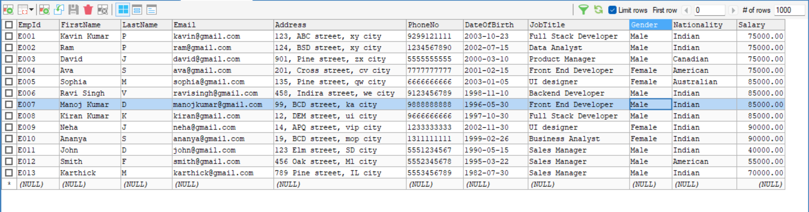
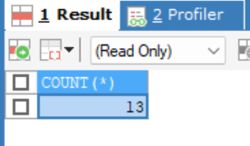
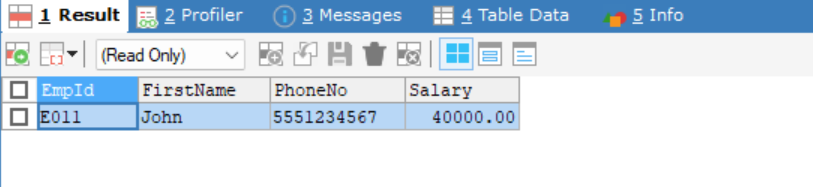
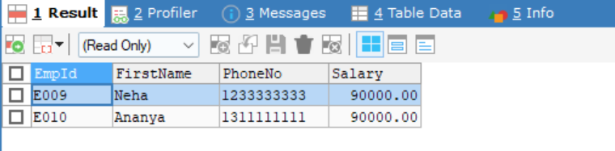
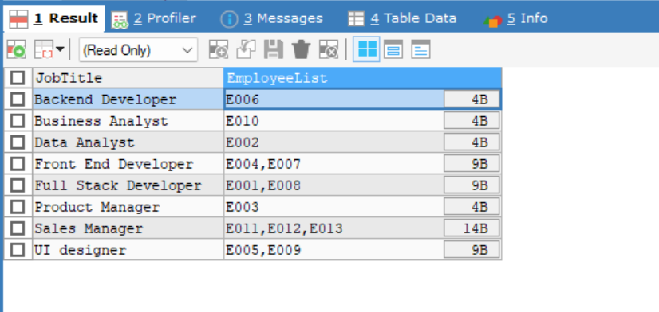
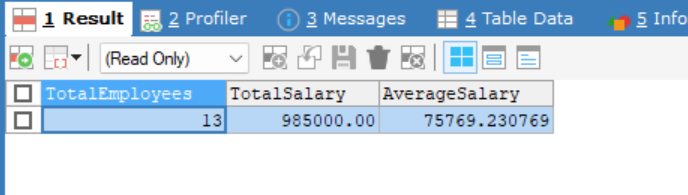
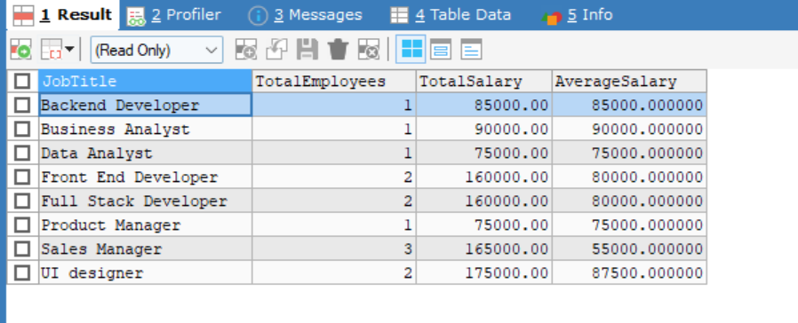
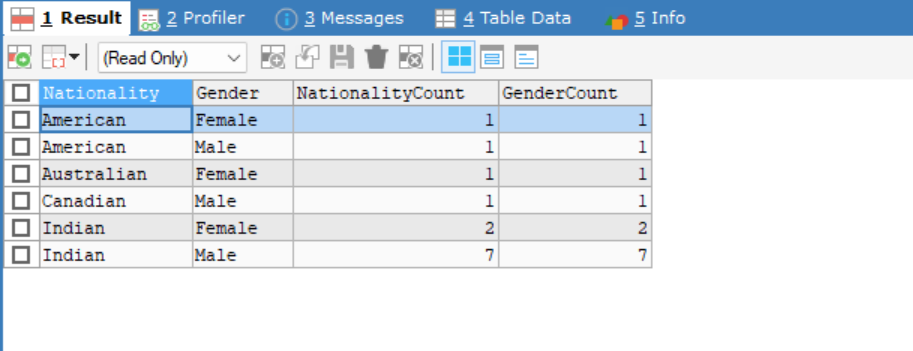
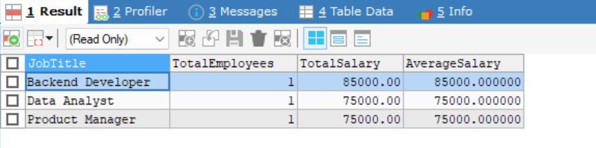
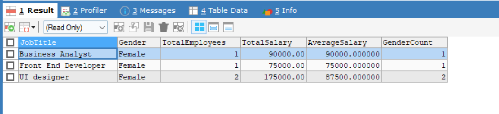

# Simple Aggregation and Grouping

## Aggregation Types in SQL

| Aggregation Type   | Description                                                          | Query                                                                                    |
| ------------------ | -------------------------------------------------------------------- | ---------------------------------------------------------------------------------------- |
| **COUNT()**        | Returns the number of rows or non-NULL values in a column.           | `SELECT JobTitle, COUNT(EmpId) AS TotalEmployees FROM employees GROUP BY JobTitle;`      |
| **SUM()**          | Returns the sum of values in a numeric column.                       | `SELECT JobTitle, SUM(Salary) AS TotalSalary FROM employees GROUP BY JobTitle;`          |
| **AVG()**          | Returns the average value of a numeric column.                       | `SELECT JobTitle, AVG(Salary) AS AverageSalary FROM employees GROUP BY JobTitle;`        |
| **MIN()**          | Returns the minimum value in a numeric column.                       | `SELECT JobTitle, MIN(Salary) AS MinSalary FROM employees GROUP BY JobTitle;`            |
| **MAX()**          | Returns the maximum value in a numeric column.                       | `SELECT JobTitle, MAX(Salary) AS MaxSalary FROM employees GROUP BY JobTitle;`            |
| **GROUP_CONCAT()** | Concatenates values from multiple rows into a single string (MySQL). | `SELECT JobTitle, GROUP_CONCAT(EmpId) AS EmployeeList FROM employees GROUP BY JobTitle;` |

## Database



## Steps

- Get the total employees count using `COUNT(*)`function

```bash
SELECT COUNT(*) FROM employees
```

## Output:



- Get the Minimum salary of the employee using `MIN(Salary)` in `WHERE` Clause

```bash
SELECT
    EmpId,
    FirstName,
    PhoneNo,
    Salary
FROM
    employees
WHERE
    Salary = (SELECT MIN(Salary) FROM employees);
```

## Output:



- Get the Maximum salary of the employee using `MAX(Salary)` in `WHERE` Clause

```bash
SELECT
    EmpId,
    FirstName,
    PhoneNo,
    Salary
FROM
    employees
WHERE
    Salary = (SELECT MAX(Salary) FROM employees);
```

## Output:



- Concatenates values from multiple rows into a single string with grouping of `JobTitle`.

```bash
SELECT
    JobTitle,
    GROUP_CONCAT(EmpId) AS EmployeeList
FROM
    employees
GROUP BY
    JobTitle
```

## Output:



- To get the total employee's count with the sum of all their salary along with average

```bash
SELECT
    COUNT(EmpId) AS TotalEmployees,
    SUM(Salary) AS TotalSalary,
    AVG(Salary) AS AverageSalary
FROM
    employees

```

## Output:



- To get the employee's count , Salary Sum, Salary Avg, based on the `JobTitle`

- The GROUP BY statement groups rows that have the same values into summary rows.

```bash
SELECT
    JobTitle,
    COUNT(EmpId) AS TotalEmployees,
    SUM(Salary) AS TotalSalary,
    AVG(Salary) AS AverageSalary
FROM
    employees
GROUP BY
    JobTitle;
```

## Output:



- To get the gender wise count with nationality
- _Group By allows to group more than one column_

```bash
SELECT
    Nationality,
    Gender,
    COUNT(Nationality) AS NationalityCount,
    COUNT(Gender) AS GenderCount
FROM
    employees
GROUP BY
    Nationality, Gender;
```

## Output:



## Having Clause

- The HAVING clause in SQL is used to filter records after an aggregation has been performed with the GROUP BY clause.

- `WHERE` clause can't be used with aggregate functions

- `HAVING` clause is applied after the aggregation results

  - In this step is to get the Sum of the salary is `less than or equal to 85000` by grouping the `JobTitle`

  ```bash
  SELECT
      JobTitle,
      COUNT(EmpId) AS TotalEmployees,
      SUM(Salary) AS TotalSalary,
      AVG(Salary) AS AverageSalary
  FROM
      employees
  GROUP BY
      JobTitle
  HAVING SUM(Salary)<=85000;
  ```

## Output:



- In `HAVING` clause, the conditional operation is also applicable `AND` , `OR`

  - In this step is to get the `sum and avg of salary`, `count of employees`, `count of gender`, and finally filtration is applied to aggregated data, whose `avg` salary is `>=`75000 `and` they must be `Female`

  ```bash
  SELECT
      JobTitle,
      Gender,
      COUNT(EmpId) AS TotalEmployees,
      SUM(Salary) AS TotalSalary,
      AVG(Salary) AS AverageSalary,
      COUNT(Gender) AS GenderCount
  FROM
      employees
  GROUP BY
      JobTitle, Gender
  HAVING AVG(Salary)>=75000 AND Gender = "Female"
  ```

## Output:



# Difference Between `WHERE` and `HAVING` in SQL

| **`WHERE`**                                               | **`HAVING`**                                                                 |
| --------------------------------------------------------- | ---------------------------------------------------------------------------- |
| Filters rows **before** grouping and aggregation.         | Filters rows **after** grouping and aggregation.                             |
| Used to filter individual rows based on a condition.      | Used to filter groups after aggregation (e.g., `COUNT()`, `SUM()`, `AVG()`). |
| Applicable to non-aggregated columns (before `GROUP BY`). | Applicable to aggregated columns (after `GROUP BY`).                         |
| Cannot be used with aggregate functions directly.         | Can be used with aggregate functions (e.g., `COUNT()`, `SUM()`).             |
| Executes before the `GROUP BY` clause.                    | Executes after the `GROUP BY` clause and aggregation.                        |
| Filters individual records or rows.                       | Filters groups formed by `GROUP BY`.                                         |
| Can be used without `GROUP BY`.                           | Requires `GROUP BY` to aggregate data.                                       |
