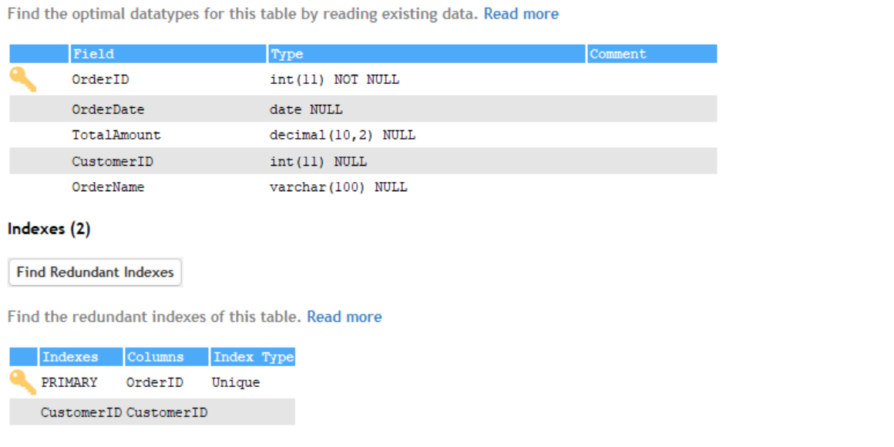
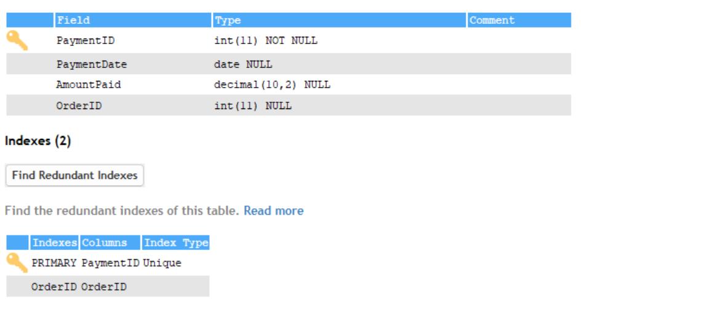
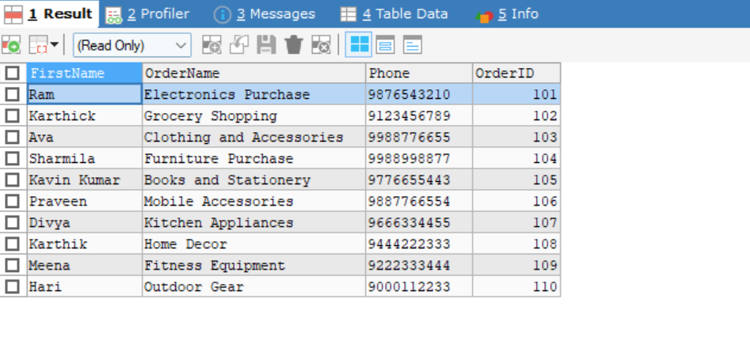
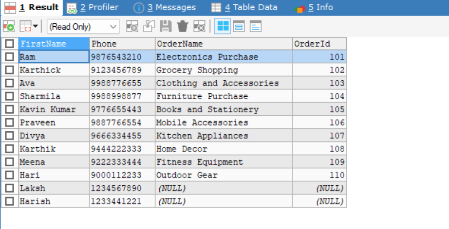
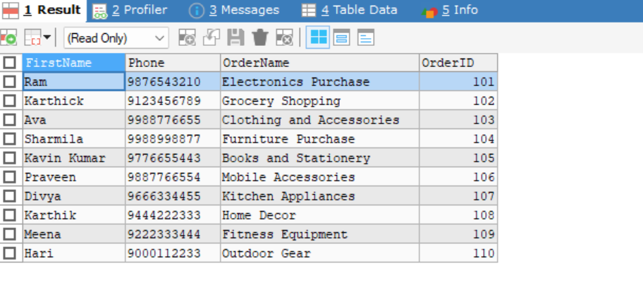
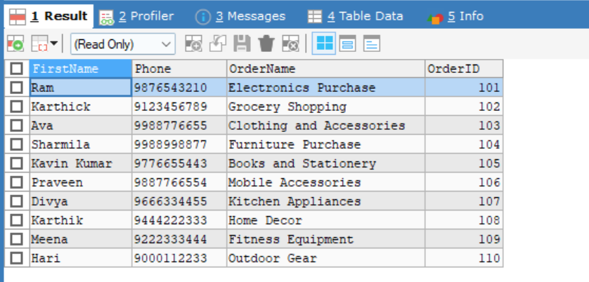
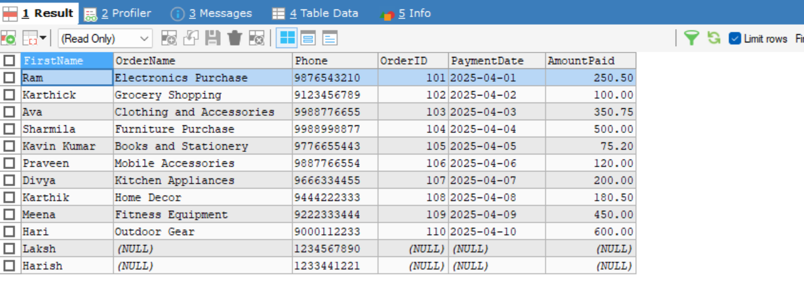

# Multi-Table JOINs

# Types of Joins Used

| **Type**    | **Description**                                                                                                                                            |
| ----------- | ---------------------------------------------------------------------------------------------------------------------------------------------------------- |
| **INNER**   | Returns only the rows with matching values in both tables. Non-matching rows are excluded.                                                                 |
| **RIGHT**   | Returns all rows from the right table and matching rows from the left table.`Non-matching rows from the left table are shown as NULL.`                     |
| **LEFT**    | Returns all rows from the left table and matching rows from the right table. `Non-matching rows from the right table are shown as NULL.`                   |
| **CROSS**   | Returns the `Cartesian product` of both tables. Each row from the first table is combined with each row from the second table.                             |
| **NATURAL** | Joins tables based on columns with the same name and data type in both tables. It `automatically` determines the join condition based on matching columns. |

## Steps

- Created a customer table using `CREATE TABLE` query

```bash
CREATE TABLE Customers (
    CustomerID INT PRIMARY KEY,
    FirstName VARCHAR(50),
    LastName VARCHAR(50),
    Email VARCHAR(100),
    Address VARCHAR(255),
    Phone VARCHAR(15)
);
```

## Output


- Created a Orders table with a `PRIMARY KEY of CustomerID`from customer table

```bash
CREATE TABLE Orders (
    OrderID INT PRIMARY KEY,
    OrderDate DATE,
    TotalAmount DECIMAL(10, 2),
    CustomerID INT,
    OrderName VARCHAR(100),
    FOREIGN KEY (CustomerID) REFERENCES Customers(CustomerID)
);
```

## Output



- Created a Payments table to store the record details about payments with a `PRIMARY KEY of OrderID from Orders table`

```bash
CREATE TABLE Payments (
    PaymentID INT PRIMARY KEY,
    PaymentDate DATE,
    AmountPaid DECIMAL(10, 2),
    OrderID INT,
    FOREIGN KEY (OrderID) REFERENCES Orders(OrderID)
);
```

## Output



- Inserted values into the Customers table using `INSERT` query

```bash
INSERT INTO Customers (CustomerID, FirstName, LastName, Email, Address, Phone)
VALUES
(1, 'Ram', 'R', 'ram@gmail.com', '123, 234 Street, XQ City', '9876543210'),
(2, 'Karthick', 'R', 'karthick@gmail.com', '456, 789 Avenue, MD City', '9123456789'),
(3, 'Ava', 'S', 'ava@gmail.com', '789, 101 Road, ABE City', '9988776655'),
(4, 'Sharmila', 'K', 'sharmila@gmail.com', '102, 303 Lane, GP City', '9988998877'),
(5, 'Kavin Kumar', 'P', 'kavin@gmail.com', '567, 890 Street, PQ City', '9776655443'),
(6, 'Praveen', 'P', 'praveen@gmail.com', '345, 678 Road, RS City', '9887766554'),
(7, 'Divya', 'V', 'divya@gmail.com', '234, 567 Street, UV City', '9666334455'),
(8, 'Karthik', 'S', 'karthik@gmail.com', '678, 123 Lane, LM City', '9444222333'),
(9, 'Meena', 'I', 'meena@gmail.com', '910, 112 Avenue, OP City', '9222333444'),
(10, 'Hari', 'V', 'hari@gmail.com', '234, 678 Street, XY City', '9000112233');
```

- Inserted values into the Orders table with a Foreign key from Customers table

```bash
INSERT INTO Orders (OrderID, OrderDate, TotalAmount, CustomerID, OrderName)
VALUES
(101, '2025-04-01', 250.50, 1, 'Electronics Purchase'),
(102, '2025-04-02', 100.00, 2, 'Grocery Shopping'),
(103, '2025-04-03', 350.75, 3, 'Clothing and Accessories'),
(104, '2025-04-04', 500.00, 4, 'Furniture Purchase'),
(105, '2025-04-05', 75.20, 5, 'Books and Stationery'),
(106, '2025-04-06', 120.00, 6, 'Mobile Accessories'),
(107, '2025-04-07', 200.00, 7, 'Kitchen Appliances'),
(108, '2025-04-08', 180.50, 8, 'Home Decor'),
(109, '2025-04-09', 450.00, 9, 'Fitness Equipment'),
(110, '2025-04-10', 600.00, 10, 'Outdoor Gear');
(111, '2025-04-11', 800.00, 11, 'Outfit Shoe');
(112, '2025-04-12', 100.00, 12, 'Mobile Cover');
```

- Inserted values to the Payments table with a Foreign key of OrderID from orders table

```bash
INSERT INTO Payments (PaymentID, PaymentDate, AmountPaid, OrderID)
VALUES
(1, '2025-04-01', 250.50, 101),
(2, '2025-04-02', 100.00, 102),
(3, '2025-04-03', 350.75, 103),
(4, '2025-04-04', 500.00, 104),
(5, '2025-04-05', 75.20, 105),
(6, '2025-04-06', 120.00, 106),
(7, '2025-04-07', 200.00, 107),
(8, '2025-04-08', 180.50, 108),
(9, '2025-04-09', 450.00, 109),
(10, '2025-04-10', 600.00, 110);
```

- **INNER JOIN** returns only the rows where there is match between two tables in this, Inner Join happened between `Customers table and Orders table` with a Reference of `CustomerID` where the data are similar between these columns

```bash
SELECT c.FirstName, o.OrderName,c.Phone, o.OrderID
FROM Customers AS c
JOIN Orders AS o ON c.CustomerID = o.CustomerID;
```

## Output



- A **LEFT JOIN** returns all the rows from the **left table** (the `Customers` table), and the matching rows from the **right table** (the `Orders` table). If there is no match, it returns `NULL` for columns from the right table.

```bash
SELECT c.FirstName,c.Phone, o.OrderName, o.OrderId
FROM Customers AS c
LEFT JOIN Orders AS o ON c.CustomerID = o.CustomerID;
```

## Output



- A **RIGHT JOIN** returns all the rows from the **right table** (the `Orders` table), and the matching rows from the **left table** (the `Customers` table). If there is no match, it returns `NULL` for columns from the left table.

```bash
SELECT c.FirstName,c.Phone, o.OrderName, o.OrderID
FROM Customers AS c
RIGHT JOIN Orders AS o ON c.CustomerID = o.CustomerID;
```

## Output



- Cross Join Returns the Cartesian product of both tables. Each row from the first table is combined with each row from the second table.
  - If the reference column data matches then they perform **INNER JOIN**
  - Other wise it will multiple each row in one table to other (cartesian product)
  - `ON` clause is not required
  - `120 rows` - 12 x 10

```bash
SELECT c.FirstName,c.Phone, o.OrderName, o.OrderID
FROM Customers AS c
CROSS JOIN Orders AS o;
```

## Output


- Joins tables based on columns with the same name and data type in both tables. it will joins automatically by SQL and there is no need for `ON` clause

  - In this the CustomerID which is present in the both columns with same data and name so **INNER JOIN** is happened

  - If the column name does not match then they perform cartesian product

```bash
SELECT c.FirstName,c.Phone, o.OrderName, o.OrderID
FROM Customers AS c
NATURAL JOIN Orders AS o;
```

## Output



- In this **LEFT JOIN** initially happens between Customers and Orders table from that result again **LEFT JOIN** is happened to get the Payments table join based on the `OrderID from Orders table`

```bash
SELECT c.FirstName, o.OrderName,c.Phone, o.OrderID, p.`PaymentDate`, p.`AmountPaid`
FROM Customers AS c
LEFT JOIN Orders AS o ON c.CustomerID = o.CustomerID
LEFT JOIN Payments AS p ON o.`OrderID` = p.`OrderID`
```


