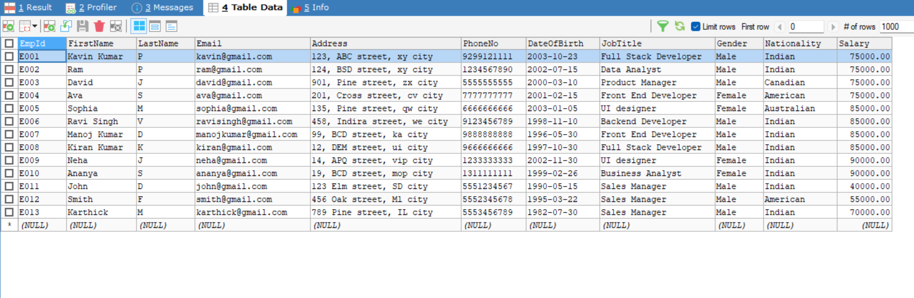
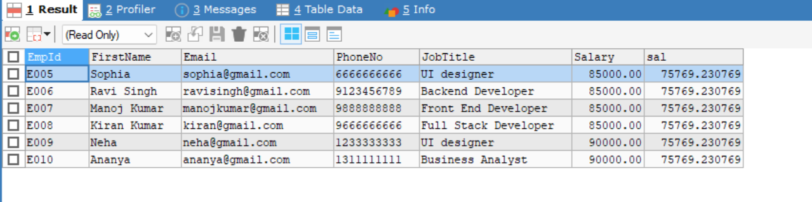
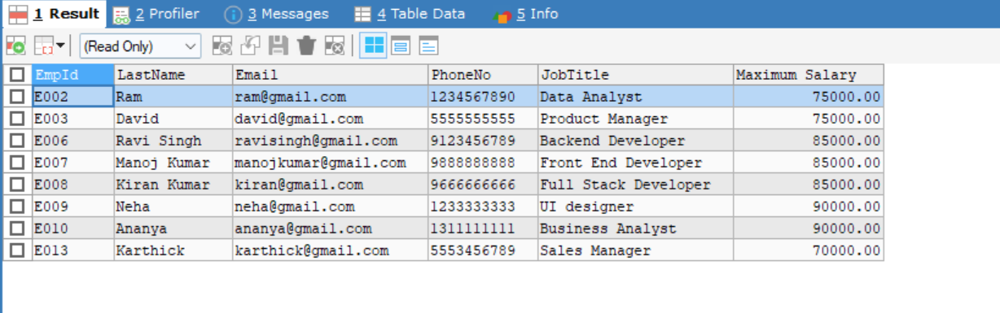

# Subqueries and Nested Queries

## Types of Subqueries

- Scalar Subquery

  - Return only one row and one column

- Multiple Subquery

  - Return multiple column and multiple row

- Correlated Subquery

  - A subquery which is related to outer query

## Database



## Steps

- Selected an employees whose salary is above the same role's average salary
- Used a `correlated subquery` which avg of role's salary query depends in main query

```bash
SELECT FirstName, Salary, JobTitle
FROM Employees e1
WHERE Salary > (SELECT AVG(Salary) FROM Employees e2 WHERE e1.JobTitle = e2.JobTitle);
```

## Output


- Selected all employees and average salary of their roles in a separate column by `subquery in SELECT`
- This is the `correlated subquery`

```bash
SELECT
    FirstName,
    JobTitle,
    Salary,
    (SELECT AVG(Salary)
FROM Employees e2
WHERE e2.JobTitle = e1.JobTitle) AS AvgJobSalary
FROM Employees e1;
```

## Output


- Selected the details of all employees whose salary is greater than the average salary of all employees in the company.
- This is a Scalar Subquery which return one row and one column

```bash
SELECT EmpId, FirstName, Email, PhoneNo, JobTitle, Salary, avg_sal.sal
FROM employees e
JOIN  (SELECT AVG(Salary) sal FROM employees) avg_sal
ON e.Salary > avg_sal.sal;
```

## Output



- Selected the employees who earn the highest salary in each department
- This is `Multiple Row` Sub Query

```bash
SELECT EmpId, FirstName LastName, Email, PhoneNo, JobTitle, Salary AS `Maximum Salary`
FROM employees
WHERE (JobTitle, Salary) IN (SELECT JobTitle, MAX(Salary)
FROM employees
GROUP BY JobTitle);
```

## Output



# Difference Between Correlated and Non-Correlated Queries

| **Correlated Subquery**                       | **Non-Correlated Subquery**                         |
| --------------------------------------------- | --------------------------------------------------- |
| References columns from the outer query       | Does not reference any columns from the outer query |
| Executed once for each row in the outer query | Executed only once for the entire query             |
| Dependent on the outer query's data           | Independent of the outer query's data               |
