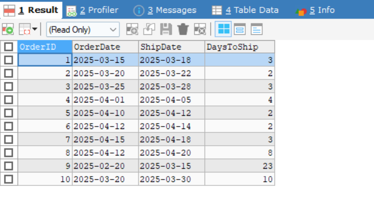
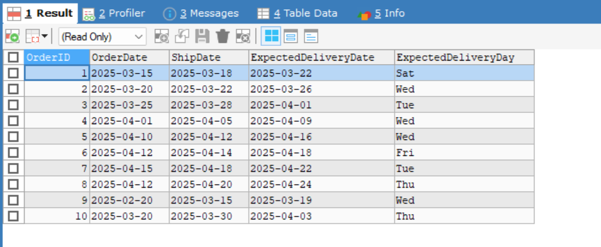
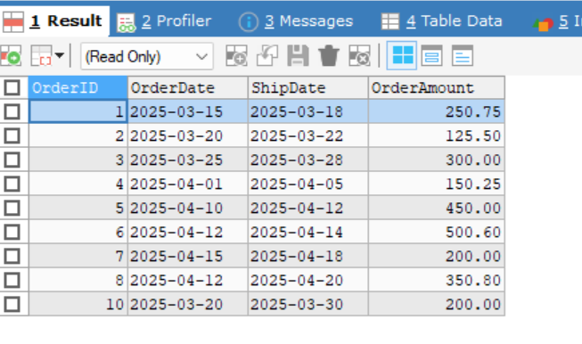
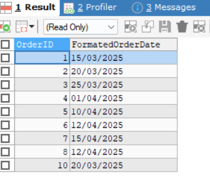

# Date and Time Functions

## Steps 

- Created a table called OrdersPlaced to store the data related about orders
like 

    - `OrderID, CustomerID, OrderDate, ShipDate, OrderAmount`

``` bash
CREATE TABLE OrdersPlaced (
    OrderID INT PRIMARY KEY,
    CustomerID INT,
    OrderDate DATE,
    ShipDate DATE,
    OrderAmount DECIMAL(10, 2)
);
```

- Inserted a sample values to it using a `INSERT INTO` query

``` bash
INSERT INTO OrdersPlaced (OrderID, CustomerID, OrderDate, ShipDate, OrderAmount)
VALUES
(1, 101, '2025-03-15', '2025-03-18', 250.75),
(2, 102, '2025-03-20', '2025-03-22', 125.50),
(3, 103, '2025-03-25', '2025-03-28', 300.00),
(4, 104, '2025-04-01', '2025-04-05', 150.25),
(5, 105, '2025-04-10', '2025-04-12', 450.00),
(6, 106, '2025-04-12', '2025-04-14', 500.60),
(7, 107, '2025-04-15', '2025-04-18', 200.00),
(8, 108, '2025-04-18', '2025-04-20', 350.80);
(9, 109, '2025-02-20', '2025-03-15', 100.00);
(10, 110, '2025-03-20', '2025-03-30', 200.00);
```

## Date functions
- calculated the day difference between shipDate and OrderDate using `DATEDIFF` function 

## Output



- Add a Approximate of 4 days from the date of Shipment using `DATE_ADD` function with `INTERVAL` Keyword
- Add also formatted that date to the day using `DATE_FORMAT` with `%a` as a formatter 

``` bash
SELECT OrderID, OrderDate, ShipDate, DATE_ADD(ShipDate, INTERVAL 4 DAY) AS ExpectedDeliveryDate,
DATE_FORMAT(DATE_ADD(ShipDate, INTERVAL 4 DAY), "%a") AS ExpectedDeliveryDay
FROM OrdersPlaced;
```

## Output



- Calculated a Products placed within the last 30 days using `CURDATE() - INTERVAL 30 DAY;`

``` bash
SELECT OrderID, OrderDate, ShipDate, OrderAmount
FROM OrdersPlaced
WHERE OrderDate >= CURDATE() - INTERVAL 30 DAY;
```

## Output



- Formatted the returned date like `DD/MM/YYYY` using `DATE_FORMAT`

``` bash
SELECT OrderID, 
       DATE_FORMAT(OrderDate, '%d/%m/%Y') AS FormatedOrderDate
FROM OrdersPlaced
WHERE OrderDate >= CURDATE() - INTERVAL 30 DAY;
```

## Output




### Date Function used 
- `DATEDIFF`: Returns the difference in days between two dates. For example, in the query:
  `SELECT OrderID, OrderDate, ShipDate, DATEDIFF(ShipDate, OrderDate) AS DaysToShip FROM OrdersPlaced;`
  This calculates the number of days it took to ship the order by subtracting the `OrderDate` from the `ShipDate`.

- `DATE_ADD`: Adds a specified time interval to a date. For example, in the query:
  `SELECT OrderID, OrderDate, ShipDate, DATE_ADD(ShipDate, INTERVAL 4 DAY) AS ExpectedDeliveryDate FROM OrdersPlaced;`
  This adds 4 days to the `ShipDate` to estimate the expected delivery date.

- `DATE_FORMAT`: Formats a date value according to the specified format. For example, in the query:
  `SELECT OrderID, DATE_FORMAT(OrderDate, '%d/%m/%Y') AS FormatedOrderDate FROM OrdersPlaced;`
  This formats the `OrderDate` as `DD/MM/YYYY` to make it more readable.

- `CURDATE`: Returns the current date in `YYYY-MM-DD` format. For example, in the query:
  `SELECT OrderID, OrderDate, ShipDate, OrderAmount FROM OrdersPlaced WHERE OrderDate >= CURDATE() - INTERVAL 30 DAY;`
  This retrieves orders placed within the last 30 days by comparing `OrderDate` with the current date.


