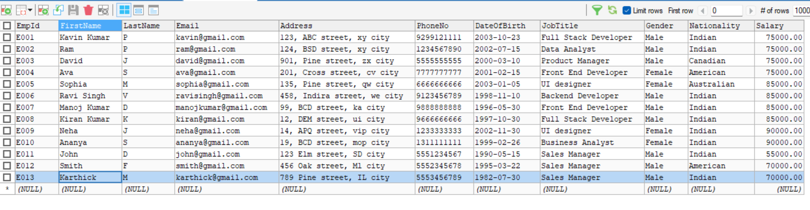
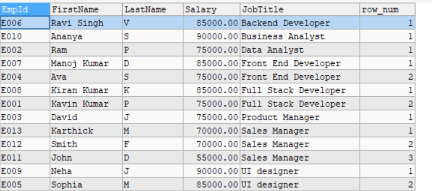
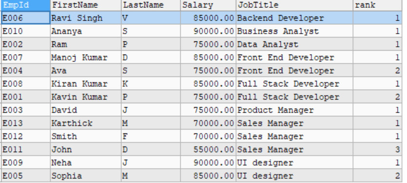
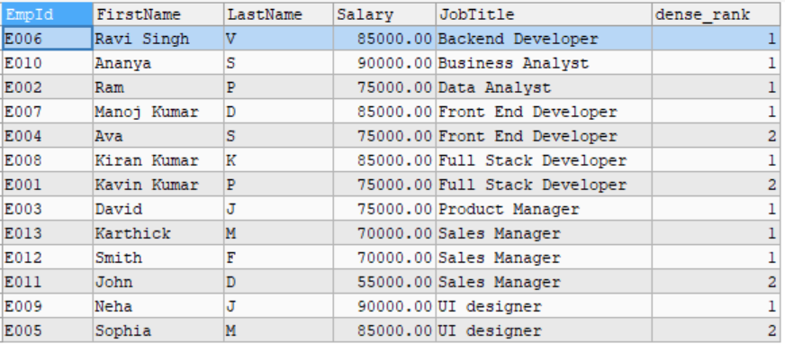
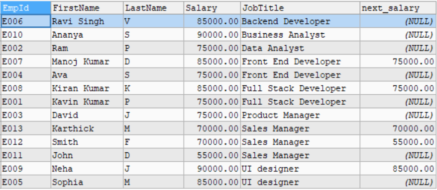
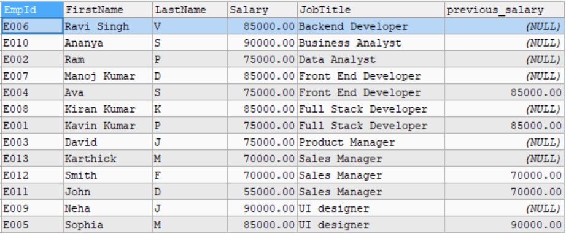

# Window Functions and Ranking

## Database available 



## Steps

1. Assigned a unique sequential number to each row within the same JobTitle by using `ROW_NUMBER()`

``` sql

SELECT
    EmpId,
    FirstName,
    LastName,
    Salary,
    JobTitle,
    ROW_NUMBER() OVER (PARTITION BY JobTitle ORDER BY Salary DESC) AS row_num
FROM
    employees;
```

### Explanation:

- `PARTITION BY JobTitle` - Makes a groups based on JobTitle
- `ORDER BY` - helps to sort in descending `DESC` order
- `ROW_NUMBER` - helps to assign a unique sequential number

## Output



2. Get the rank for each employee based on Salary in Descending order by using `RANK()` function, which skips the subsequent ranks

``` sql
SELECT
    EmpId,
    FirstName,
    LastName,
    Salary,
    JobTitle,
    RANK() OVER (PARTITION BY JobTitle ORDER BY Salary DESC) AS RANK
FROM
    employees;
```

### Explanation

- `PARTITION BY JobTitle` - Groups based on JobTitle
- `ORDER BY` -  helps to make a sort in descending order (salary)
- `RANK()` - Assigns a rank based on the salary and subsequent rank are skipped
- In the output the EmpId `E011` gets a rank 3 and the people belongs to their department get rank 1

## Output 



3. Get the rank of the employees but without skipping the subsequent rank when there is ties happens, so that all the employees will get next rank without skipping using `DENSE_RANK()`

``` sql

SELECT
    EmpId,
    FirstName,
    LastName,
    Salary,
    JobTitle,
    DENSE_RANK() OVER (PARTITION BY JobTitle ORDER BY Salary DESC) AS DENSE_RANK
FROM
    employees;
```

### Explanation

- `PARTITION BY JobTitle` - Groups based on JobTitle
- `ORDER BY` -  helps to make a sort in descending order (salary)
- `DENSE_RANK()` - helps to assign a rank without skipping
- In the output now the EmpId `E011` gets 2nd rank among their department

## Output



4. Get the next employee salary using `LEAD()` function, which is often used to compare the value of `current row` to the value of `next row`

``` sql
SELECT
    EmpId,
    FirstName,
    LastName,
    Salary,
    JobTitle,
    LEAD(Salary) OVER (PARTITION BY JobTitle ORDER BY Salary DESC) AS next_salary
FROM
    employees;
```

### Explanation

- `PARTITION BY JobTitle` - Groups based on JobTitle
- `ORDER BY` -  helps to make a sort in descending order (salary)
- `LEAD(SALARY)` - helps to  access the next employee's salary value

## Output



5. Get the previous employee's salary in the table using `LAG()` function, often used to compare current row with previous row

``` sql
SELECT
    EmpId,
    FirstName,
    LastName,
    Salary,
    JobTitle,
    LAG(Salary) OVER (PARTITION BY JobTitle ORDER BY Salary DESC) AS previous_salary
FROM
    employees;
```

### Explanation

- `PARTITION BY JobTitle` - Groups based on JobTitle
- `ORDER BY` -  helps to make a sort in descending order (salary)
- `LAG(SALARY)` - helps to  access the previous employee's salary value

## Output



| **Function**      | **Description**                                                                                       |
|-------------------|-------------------------------------------------------------------------------------------------------|
| **ROW_NUMBER()**   | Assigns a `unique sequential number` to each row within a partition, with no ties.                      |
| **RANK()**         | Assigns ranks to rows, with ties receiving the same rank, but `subsequent ranks are skipped.`           |
| **DENSE_RANK()**   | Assigns ranks to rows, with ties receiving the same rank, `but no gaps between subsequent ranks.`       |
| **LEAD()**         | Accesses the value of the `next row` within the partition, based on the ordering of the rows.            |
| **LAG()**          | Accesses the value of the `previous row` within the partition, based on the ordering of the rows.        |
