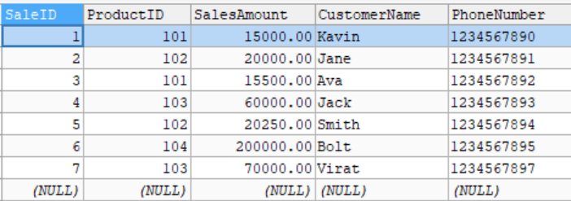
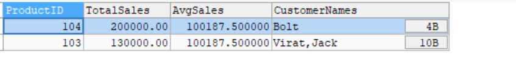
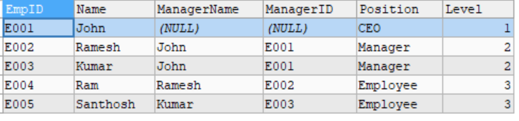

# Common Table Expressions (CTEs) and Recursive Queries

- A `CTE` is a temporary result set defined within a query to simplify complex SQL statements. It helps to break down large queries into more manageable parts for better readability and maintenance.

- A `recursive CTE` is used to query hierarchical data, like organizational structures or category trees. It references itself to iterate over parent-child relationships.

## Tables

- Sales Table
    - 

- ProductsName Table
    - 

- EmployeeHierarchy Table
    - 

# Steps

## 1. Creation and Insertion of Sales Table

- Created a table called Sales with attribute like `SaleID`, `ProductID`, `SalesAmount`, `CustomerName`, `PhoneNumber`

``` sql
CREATE TABLE Sales (
    SaleID INT PRIMARY KEY,
    ProductID INT,
    SalesAmount DECIMAL(10, 2),
    CustomerName VARCHAR(100),
    PhoneNumber VARCHAR(15)
);
```

- Insert the sample data to the Sales table

``` sql
INSERT INTO Sales (SaleID, ProductID, SalesAmount, CustomerName, PhoneNumber) VALUES
(1, 101, 15000.00, 'Kavin', '1234567890'),
(2, 102, 20000.00, 'Jane', '1234567891'),
(3, 101, 15500.00, 'Ava', '1234567892'),
(4, 103, 60000.00, 'Jack', '1234567893'),
(5, 102, 20250.00, 'Smith', '1234567894'),
(6, 104, 200000.00, 'Bolt', '1234567895'),
(7, 103, 70000.00, 'Virat', '1234567897');
```

## 2. Created ProductsName table and Inserted values

- Created another table called ProductsName with the attribute of `ProductID` and `ProductName` to store the ProductsName for reference to Sales table

``` sql
CREATE TABLE ProductsName
(
ProductID INT PRIMARY KEY,
ProductName VARCHAR(255)
)
```

- Inserted a Sample data

``` sql
INSERT INTO ProductsName
VALUES
(101, 'Samsung M series'),
(102, 'One Plus Nord series'),
(103, 'Iphone 16 FE'),
(104, 'Vision Pro Max')
```

## 3. Applied a Common Table Expression

- For finding the Products who's sale is better than the average sales across all the products
- For this using the CTE is a optimized way to predefine a `ProductSales` and `AverageSales`


``` sql
WITH ProductSales AS (
    SELECT
        ProductID,
        SUM(SalesAmount) AS TotalSales
    FROM
        Sales
    GROUP BY
        ProductID
),
AverageSales AS (
    SELECT
        AVG(TotalSales) AS AvgSales
    FROM
        ProductSales
)

SELECT
    p.ProductID,
    p.TotalSales,
    av.AvgSales,
    GROUP_CONCAT(s.CustomerName) AS CustomerNames
FROM
    ProductSales p
JOIN
    Sales s ON s.ProductID = p.ProductID
JOIN
    AverageSales av
ON
    p.TotalSales > av.AvgSales
GROUP BY
    p.ProductID, p.TotalSales, av.AvgSales
ORDER BY
    p.TotalSales DESC;
```

### Explanation

- In this `ProductSales` CTE will find a TotalSales across the Products
- In the `AverageSales` CTE will find a Average from the `TotalSales` which is present in the `ProductSales` CTE
- In the main query Displaying the `ProductID`, `totalSales`, `AvgSales`, `CustomerName` as `GROUP_CONCAT` because many people bought a same products by **INNER JOIN** with the `Sales` table
- In `ON` clause find a `TotalSales` which are  greater than `AvgSales`
- In `GROUP BY` - `ProductID`, `TotalSales`, `AvgSales` are grouped
- In `ORDER BY` - `TotalSales` are sorted based on `DESC` order

## Output




## 4. Created a EmployeeHierarchy table and inserted values

- Created a table called `EmployeeHierarchy` with the data `EmpID`, `NAME`, `PhoneNo`, `Email`, `ManagerID`, `POSITION`

``` sql
CREATE TABLE EmployeeHierarchy (
    EmpID VARCHAR(20) NOT NULL PRIMARY KEY,
    NAME VARCHAR(255) NOT NULL,
    PhoneNo VARCHAR(15) NULL,
    Email VARCHAR(255) NULL,
    ManagerID VARCHAR(20) NULL,
    POSITION VARCHAR(255) NULL
);
```

- Inserted Sample values into that table

``` sql
INSERT INTO EmployeeHierarchy (EmpID, NAME, PhoneNo, Email, ManagerID, POSITION) 
VALUES ('E001', 'John', '1234567890', 'john@gmail.com', NULL, 'CEO'),
('E002', 'Ramesh', '2345678901', 'ramesh@gmail.com', 'E001', 'Manager'),
('E003', 'Kumar', '3456789012', 'kumar@gmail.com', 'E001', 'Manager'),
('E004', 'Ram', '4567890123', 'ram@gmail.com', 'E002', 'Employee'),
('E005', 'Santhosh', '5678901234', 'santhosh@gmail.com', 'E003', 'Employee');
```

## 5. Used a `RECURSIVE CTE`

``` sql
WITH RECURSIVE EmpHierarchy AS (
    SELECT EmpId, NAME,ManagerID, POSITION, 1 AS LEVEL
    FROM EmployeeHierarchy
    WHERE NAME = 'John'

    UNION ALL

    SELECT E.EmpId, E.Name, E.ManagerID, E.Position, H.Level + 1 AS LEVEL
    FROM EmployeeHierarchy E
    JOIN EmpHierarchy H ON E.ManagerID = H.EmpId
)

SELECT eh.EmpID, eh.Name, mn.Name AS ManagerName, eh.ManagerID, eh.Position, eh.Level
FROM EmpHierarchy eh
LEFT JOIN EmployeeHierarchy mn ON mn.EmpID = eh.ManagerID;
```

### Explanation

- Created a `EmpHierarchy` with `RECURSIVE` CTE
- get the data for John who acts as a `CEO` of the company- Non recursive query
- get the level of each one using a recursive query and with a `termination condition` in `ON` clause
- Level gets increment and passed as input for next Iteration
- In main query get the all the details about employee and `Left joined` with original table to find their manager names based on managerId.

#### Condition

- Base case - CEO of the company. 
- Recursive case - Joins with employee with their managers and Increments the level of employee.
- Termination - When no employees are found.

## Output


