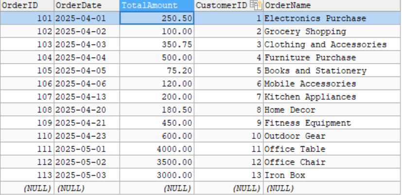
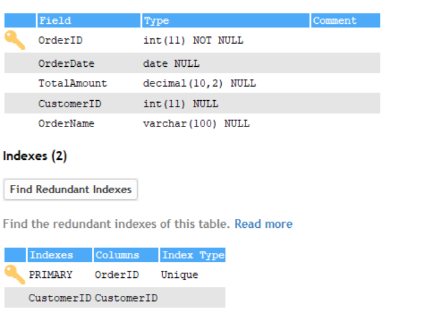
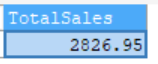
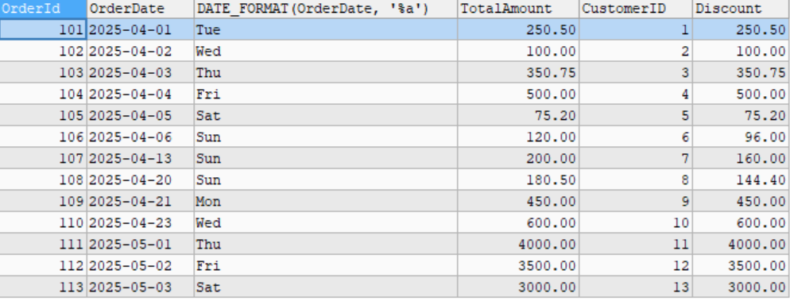

# Stored Procedures and User-Defined Functions

- Stored Procedures used for executing complex operations, possibly modifying data and can return results via output parameter

- Used Defined functions used to compute and return values based on inputs but can't modify the data

## Table






## Steps:

1. Created a Stored Procedure to calculate the total sales under specific dates

``` sql
DELIMITER $$
CREATE PROCEDURE GetTotalOrderedAmount(startDate DATE, EndDate DATE)
BEGIN
SELECT SUM(TotalAmount) AS TotalSales FROM Orders WHERE 
OrderDate BETWEEN startDate AND EndDate;

END $$
DELIMITER ;

```


### Explanation

- `DELIMITER $$` - used to change the default SQL delimiter (;) to a different one ($$), and avoids errors while working with multiple statements

- `CREATE PROCEDURE GetTotalOrderedAmount(startDate DATE, EndDate DATE)` - Created Procedure by accepting the start and end data as params

- `BEGIN` - Starts the execution of procedure

- `SELECT SUM(TotalAmount) AS TotalSales FROM Orders WHERE OrderDate BETWEEN startDate AND EndDate;` - Helps to get the total amount under the specific dates

- `END $$ DELIMITER ;` - End the Procedure and change the delimiter to `;`


## Output


2. Call the Stored Procedure

``` sql
CALL GetTotalOrderedAmount('2025-04-01', '2025-04-30')
```

- `CALL` - executes the procedure by passing dates as arguments

## Output



3. Created a User Defined function

- Created a Function called `SundaySpecialDiscount` which gives `20%` discount for those who ordered in sunday

``` sql

DELIMITER $$

CREATE FUNCTION SundaySpecialDiscount(amount DECIMAL(10,2), OrderDate DATE)
RETURNS DECIMAL(10,2)
BEGIN
    DECLARE discount DECIMAL(10,2);

    IF DATE_FORMAT(OrderDate, '%a') = 'Sun' THEN
        SET discount = amount * 0.20;
        RETURN amount - discount; 
    ELSE     
        RETURN amount;
    END IF;
END$$

DELIMITER ;
```

### Explanation

- `DELIMITER $$` - used to change the default SQL delimiter (;) to a different one ($$), and avoids errors while working with multiple statements

- `CREATE FUNCTION SundaySpecialDiscount(amount DECIMAL(10,2), OrderDate DATE)` - Created a SundaySpecialDiscount with 2 params - amount and orderDate

- `RETURNS DECIMAL(10,2)` - Specified that the function will return a decimal value

- `BEGIN` - Start the execution

- `DECLARE discount DECIMAL(10,2);` - Declared a variable called discount to store the discounted amount

- `IF DATE_FORMAT(OrderDate, '%a') = 'Sun' THEN` - Verify the OrderDate is Sunday by using `%a` date format 

- `SET discount = amount * 0.20;
    RETURN amount - discount;` - Condition pass then set the 20% discount for ordered amount and return by subtracting the actual amount with discount

- `ELSE     
  RETURN amount;` - other wise return the actual amount

- `END IF;` -End of the If

- `END$$` - End of Procedure

- `DELIMITER ;` - Default Delimiter

## Output


4. Call the User defined function

- Get the details about order, and related details along with calculated discount amount if they have ordered in `sunday`

``` sql
SELECT OrderId, OrderDate, DATE_FORMAT(OrderDate, '%a'), TotalAmount, CustomerID, 
SundaySpecialDiscount(TotalAmount, OrderDate) AS Discount FROM Orders
```

## Output

