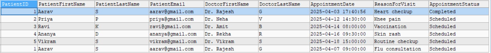
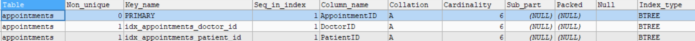
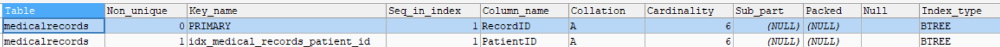
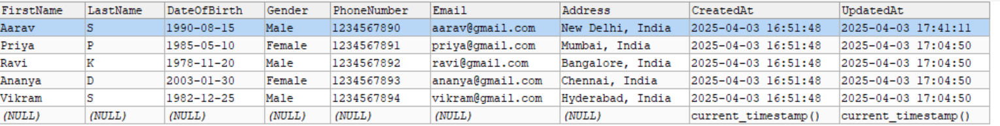
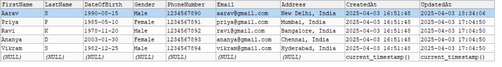
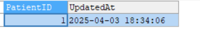
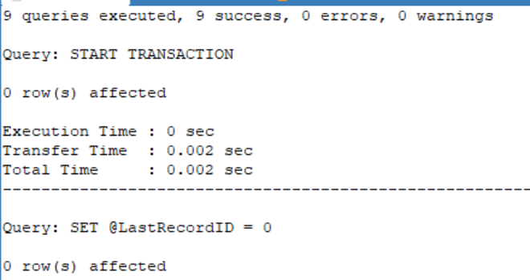

# Comprehensive Database Design, Optimization, and Advanced Features

## Hospital Management System Schema

| **Table Name**     | **Description**                                                                                                                                                                                                                                                                                                                                                                                                                                                           |
| ------------------ | ------------------------------------------------------------------------------------------------------------------------------------------------------------------------------------------------------------------------------------------------------------------------------------------------------------------------------------------------------------------------------------------------------------------------------------------------------------------------- |
| **Patients**       | Stores information about `patients`, including personal details such as `name`, `date of birth`, `gender`, `phone number`, `email`, and `address`. Each patient has a unique `PatientID`.                                                                                                                                                                                                                                                                                 |
| **Doctors**        | Stores details about doctors, including `name`, `specialty`, `phone number`, and `email`. Each doctor has a unique `DoctorID`.                                                                                                                                                                                                                                                                                                                                            |
| **Appointments**   | Stores appointment details, including patient and doctor associations, the `appointment date and time`,`reason for visit`, and the `appointment status`. It links to both the `Patients` and `Doctors` tables.                                                                                                                                                                                                                                                            |
| **MedicalRecords** | Stores medical records for each patient, including `diagnosis`, `treatment plan`, `prescriptions`, and the date of `record creation`. Linked to the `Patients` table via `PatientID`.                                                                                                                                                                                                                                                                                     |
| **Indexes**        | Indexes are created to improve performance by speeding up lookups. The following indexes are used: <br>- `idx_appointments_doctor_id`: Index on `DoctorID` in the `Appointments` table to speed up searches by doctor. <br>- `idx_medical_records_patient_id`: Index on `PatientID` in the `MedicalRecords` table to speed up searches by patient. <br>- `idx_appointments_patient_id`: Index on `PatientID` in the `Appointments` table to speed up searches by patient. |
| **Triggers**       | Contains a trigger to update patient records, such as setting the `updated appointment date` in `Patient` table after an appointment is `completed`.                                                                                                                                                                                                                                                                                                                      |

| **Concept**       | **Description**                                                                                                             |
| ----------------- | --------------------------------------------------------------------------------------------------------------------------- |
| **Normalization** | Process of organizing data in a database to reduce redundancy and improve data integrity.                                   |
| **Indexing**      | Creating indexes on frequently queried columns to speed up retrieval and improve performance.                               |
| **Triggers**      | Automatically executing predefined actions in the database when certain events occur, enforcing business rules.             |
| **Transactions**  | Ensuring data consistency by grouping multiple operations together, with the ability to commit or roll back changes.        |
| **Views**         | Virtual tables that provide a simplified or customized view of data from one or more tables, often used to hide complexity. |

## 1. Creation of all tables

```sql
CREATE TABLE Patients (
    PatientID INT PRIMARY KEY,
    FirstName VARCHAR(100) NOT NULL,
    LastName VARCHAR(100) NOT NULL,
    DateOfBirth DATE NOT NULL,
    Gender VARCHAR(10),
    PhoneNumber VARCHAR(15),
    Email VARCHAR(255) UNIQUE,
    Address VARCHAR(255),
    CreatedAt TIMESTAMP DEFAULT CURRENT_TIMESTAMP,
    UpdatedAt TIMESTAMP DEFAULT CURRENT_TIMESTAMP ON UPDATE CURRENT_TIMESTAMP
);

----

CREATE TABLE Doctors (
    DoctorID INT PRIMARY KEY,
    FirstName VARCHAR(100) NOT NULL,
    LastName VARCHAR(100) NOT NULL,
    Specialty VARCHAR(100),
    PhoneNumber VARCHAR(15),
    Email VARCHAR(255) UNIQUE,
    CreatedAt TIMESTAMP DEFAULT CURRENT_TIMESTAMP
);

----

CREATE TABLE Appointments (
    AppointmentID INT PRIMARY KEY,
    PatientID INT NOT NULL,
    DoctorID INT NOT NULL,
    AppointmentDate TIMESTAMP NOT NULL,
    ReasonForVisit VARCHAR(255),
    STATUS VARCHAR(50) DEFAULT 'Scheduled',
    FOREIGN KEY (PatientID) REFERENCES Patients(PatientID) ON DELETE CASCADE,
    FOREIGN KEY (DoctorID) REFERENCES Doctors(DoctorID) ON DELETE CASCADE
);

----

CREATE TABLE MedicalRecords (
    RecordID INT PRIMARY KEY,
    PatientID INT NOT NULL,
    Diagnosis VARCHAR(255),
    Treatment VARCHAR(255),
    Prescription VARCHAR(255),
    RecordDate TIMESTAMP DEFAULT CURRENT_TIMESTAMP,
    FOREIGN KEY (PatientID) REFERENCES Patients(PatientID) ON DELETE CASCADE
);

```

- `ON DELETE CASCADE`- ensures that when a record in the referenced table is deleted, all related records in the dependent table are automatically deleted as well.
- It maintains `referential integrity` by removing dependent data to avoid unnecessary records.

## 2. Insert the Sample Data into the table

```sql

INSERT INTO Patients (PatientID, FirstName, LastName, DateOfBirth, Gender, PhoneNumber, Email, Address)
VALUES
(1, 'Aarav', 'S', '1990-08-15', 'Male', '1234567890', 'aarav@gmail.com', 'New Delhi, India'),
(2, 'Priya', 'P', '1985-05-10', 'Female', '1234567891', 'priya@gmail.com', 'Mumbai, India'),
(3, 'Ravi', 'K', '1978-11-20', 'Male', '1234567892', 'ravi@gmail.com', 'Bangalore, India'),
(4, 'Ananya', 'D', '2003-01-30', 'Female', '1234567893', 'ananya@gmail.com', 'Chennai, India'),
(5, 'Vikram', 'S', '1982-12-25', 'Male', '1234567894', 'vikram@gmail.com', 'Hyderabad, India');

----

INSERT INTO Doctors (DoctorID, FirstName, LastName, Specialty, PhoneNumber, Email)
VALUES
(101, 'Dr. Rajesh', 'G', 'Cardiologist', '9812222222', 'rajesh@hospital.com'),
(102, 'Dr. Neha', 'V', 'Orthopedist', '9055555551', 'neha@hospital.com'),
(103, 'Dr. Amit', 'B', 'Pediatrician', '8887774444', 'amit@hospital.com'),
(104, 'Dr. Rekha', 'R', 'Dermatologist', '8888888800', 'rekha@hospital.com'),
(105, 'Dr. Vikram', 'S', 'General Practitioner', '333333344', 'vikram@hospital.com');

----

INSERT INTO Appointments (AppointmentID, PatientID, DoctorID, AppointmentDate, ReasonForVisit, STATUS)
VALUES
(1, 1, 101, '2025-04-10 10:00:00', 'Heart checkup', 'Scheduled'),
(2, 2, 102, '2025-04-12 14:30:00', 'Knee pain', 'Scheduled'),
(3, 3, 103, '2025-04-14 08:00:00', 'Vaccination', 'Scheduled'),
(4, 4, 104, '2025-04-16 09:30:00', 'Skin rash', 'Scheduled'),
(5, 5, 105, '2025-04-18 15:00:00', 'Routine checkup', 'Scheduled');

----

INSERT INTO MedicalRecords (RecordID, PatientID, Diagnosis, Treatment, Prescription, RecordDate)
VALUES
(1, 1, 'Hypertension', 'Blood pressure management', 'ABC', '2025-04-10 10:30:00'),
(2, 2, 'Osteoarthritis', 'Physical therapy and pain relief', 'DFC', '2025-04-12 15:00:00'),
(3, 3, 'Routine checkup', 'General examination', 'None', '2025-04-14 08:30:00'),
(4, 4, 'Eczema', 'Topical treatment', 'HND cream', '2025-04-16 10:00:00'),
(5, 5, 'Healthy', 'No treatment required', 'None', '2025-04-18 15:30:00');
```

- All the data inserted with a reference value to other table for collecting data

## 3. Indexes created for optimized result

```sql
CREATE INDEX idx_appointments_doctor_id ON Appointments(DoctorID);

CREATE INDEX idx_medical_records_patient_id ON MedicalRecords(PatientID);

CREATE INDEX idx_appointments_patient_id ON Appointments(PatientID);
```

- It is used to improve query performance by allowing faster retrieval of data from tables.
- `idx_appointments_doctor_id`: Index on DoctorID in the Appointments table.
- `idx_medical_records_patient_id`: Index on PatientID in the MedicalRecords table.
- `idx_appointments_patient_id`: Index on PatientID in the Appointments table.

## 4. Triggers Setup for Business Rules

```sql
DELIMITER $$

CREATE TRIGGER UpdateAppointmentStatus
AFTER UPDATE ON Appointments
FOR EACH ROW
BEGIN
    IF NEW.Status = 'Completed' THEN
        UPDATE Patients
        SET UpdatedAt = NEW.AppointmentDate
        WHERE PatientID = NEW.PatientID;
    END IF;
END $$

DELIMITER ;
```

- `DELIMITER $$` - Escapes from sql parser during execution for temporarily.
- `AFTER UPDATE ON Appointments` - Initiate the trigger when their is an update happened in Appointments table.
- `FOR EACH ROW` - Apply for each and every records. -`IF NEW.Status = 'Completed' THEN` - If the Status is completed, then allow the execution inside the `IF`
- ` UPDATE Patients
SET UpdatedAt = NEW.AppointmentDate
WHERE PatientID = NEW.PatientID;` - Update the date to the Patients table

## Output


## 5. Transactions for multi-step operations

```sql
START TRANSACTION;

SET @LastRecordID = 0;
SET @LastAppointmentID = 0;

SELECT MAX(RecordID) + 1 INTO @LastRecordID FROM MedicalRecords;

SELECT MAX(AppointmentID) + 1 INTO @LastAppointmentID FROM Appointments;

INSERT INTO MedicalRecords (RecordID, PatientID, Diagnosis, Treatment, Prescription, RecordDate)
VALUES (@LastRecordID, 1, 'Flu', 'Rest and hydration', 'Paracetamol', '2025-04-05 10:00:00');

INSERT INTO Appointments (AppointmentID, PatientID, DoctorID, AppointmentDate, ReasonForVisit, STATUS)
VALUES (@LastAppointmentID, 1, 101, '2025-04-07 09:00:00', 'Flu consultation', 'Scheduled');

COMMIT;

ROLLBACK;

```

- `START TRANSACTION;` - Initiated the transaction.
- `SET @LastRecordID = 0;
SET @LastAppointmentID = 0;` - Variable declaration for storing the latest Id.
- `SELECT MAX(RecordID) + 1 INTO @LastRecordID FROM MedicalRecords;` - Get the Maximum record id + 1 and set it in the LastRecordID.
- `SELECT MAX(AppointmentID) + 1 INTO @LastAppointmentID FROM Appointments;` - get the maximum appointmentId+1 and set it to the LastAppointmentID.

- Inserting the values to the 2 different tables `MedicalRecords`, `Appointments`

- `COMMIT` - Helps to commit the transaction to particular table.
- `ROLLBACK` - Helps to cancel the transaction if any unexpected error occurs

## 6. Views

```sql
CREATE VIEW PatientAppointmentDetails AS
SELECT
    p.PatientID,
    p.FirstName AS PatientFirstName,
    p.LastName AS PatientLastName,
    p.Email AS PatientEmail,
    d.FirstName AS DoctorFirstName,
    d.LastName AS DoctorLastName,
    a.AppointmentDate,
    a.ReasonForVisit,
    a.Status AS AppointmentStatus
FROM
    Patients p
JOIN
    Appointments a ON p.PatientID = a.PatientID
JOIN
    Doctors d ON a.DoctorID = d.DoctorID;

SELECT * FROM PatientAppointmentDetails;
```

- `VIEW` - helps to create a virtual table, instead of storing data on disk, it dynamically retrieves data
- In this I get the data from `Patients`, `Appointments`, `Doctors` tables and merge them as a `PatientAppointmentDetails` view

## Output



```sql
SHOW INDEX FROM Appointments;
SHOW INDEX FROM MedicalRecords;
```

## Output




## 7. Testing

```sql
UPDATE Appointments
SET STATUS = 'Completed'
WHERE AppointmentID = 1;

SELECT PatientID, UpdatedAt FROM Patients WHERE PatientID = 1;

SELECT * FROM PatientAppointmentDetails WHERE PatientID = 1;

```

- Tested by updated the Appointments table - Status to `Completed` and after that triggers update the date to the Patients table

## Output

### Before Trigger



### After Trigger




## After Completion of Transaction


